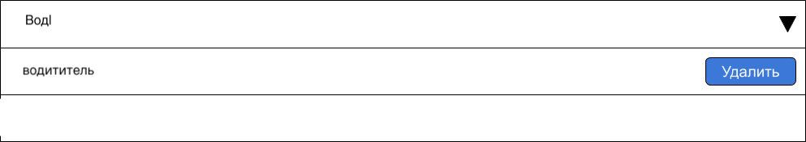
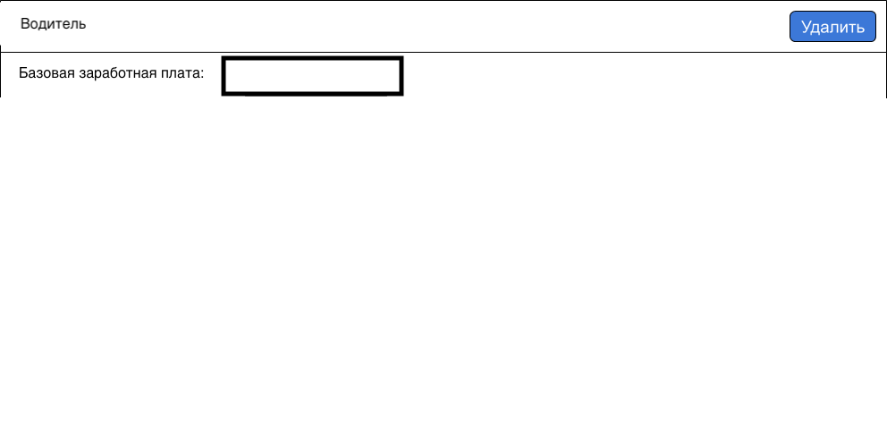

# Тестовое задание

## Задача

Реализовать конфигуратор должностей.

Основные элементы конфигуратора:

#### 1. Элемент для поиска должностей

1. Список должностей грузится с бэкенда асинхронно.

    Бэкенд реализовывать не нужно — список должностей нужно грузить из [JSON-файла](/json_file.json).

    .png)
1. Элемент поддерживает фильтрацию по названию.

    Достаточно реализовать простой поиск и показывать только те должности, названия которых начинаются с введенного текста или имеют совпадение.

    
1. Нажатие на "Добавить" рядом с названием должности, добавляет ее в список настроенных должностей.
1. Для должностей, добавленных в список настроенных должностей, вместо кнопки "Добавить" отображается кнопка "Удалить", которая отменяет настройку заработной платы и убирает ее из списка.

#### 2. Список настроенных должностей

1. Должности в списке упорядочены по алфавиту.
2. Для каждой позиции в списке задается базовая заработная плата.

    Поле поддерживает ввод только цифр.
3. У каждой позиции списка есть кнопка "Удалить". Ее поведение описано в п. 1.4.

    

#### 4. Кнопка "Сохранить изменения"

1. При нажатии на кнопку происходит проверка формы.
2. Если список настроенных должностей, должно показываться сообщение "Должность не настроена".
3. Если для должности не задана базовая заработная плата — под полем ввода базовой заработной платы должно отображаться сообщение "Укажите заработную плату".
7. Если форма не содержит ошибок — показывается сообщение "Сохранено" и в консоль логируется состояние формы в следующем формате:
    ```json
    [
      {
        "rate_area_id": ID-должности,
        "base_charge_value": Заработная-плата,
      }
    ]
    ```

## Требования

1. Реализовать на jQuery (допустимо использование любых плагинов) или чистом Javascript (ECMAScript 6).
2. JSON-файл должен загружаться AJAX-запросом. Пока файл не загружен, никаких элементов UI, относящихся к фильтрам, не должно быть отрисовано.
3. Код структурировать и разделять — должна просматриваться архитектура Javascript приложения.
4. Использовать семантическую верстку, именовать блоки.
5. Старые браузеры не поддерживать: должно работать в самых новых версиях Firefox и Chrome.
6. Результат оформить в виде репозитория на Github.
